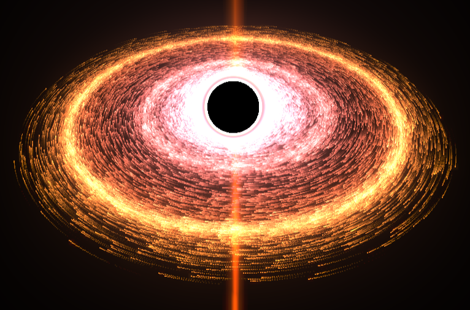
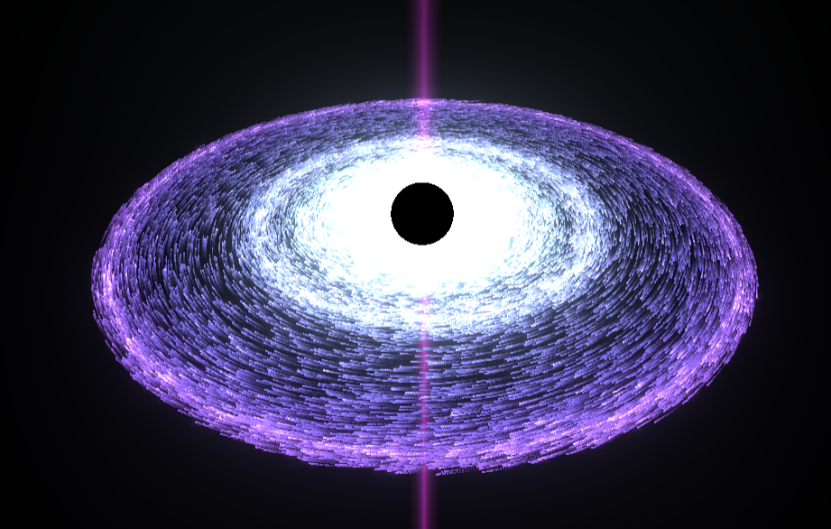

# 🕳️ Realistic Black Hole Visualization

A stunning, real-time black hole simulation built using **Three.js**, complete with an accretion disk, gravitational lensing, animated particles, star fields, and vertical light jets. Customize the appearance using dynamic themes and shaders — all rendered right in the browser.

## 🌌 Features

- 🌠 **Fully 3D Black Hole Simulation**
- 💫 Realistic **accretion disk particles** with motion and gravitational effects
- 🌈 **Lensing shader** to simulate light bending near the event horizon
- ✨ **Vertical light jets** with animated procedural glow
- 🌟 Dynamic **star field** background with color variation
- 🎨 **Multiple visual themes**: Inferno, Nebula, Glacial, Emerald, Crimson Void
- 🧠 Performance-optimized using `requestAnimationFrame`, GPU shaders, and buffer geometries
- ⚙️ Built with **Three.js**, `UnrealBloomPass`, `AfterimagePass`, and custom GLSL shaders

## 🖼️ Screenshots

| Inferno Theme | Glacial Theme |
|:-------------:|:-------------:|
|  |  |

*(Make sure to add screenshots in a `/screenshots` folder)*

## 🚀 Getting Started

### 1. Clone the repository

```bash
git clone https://github.com/your-username/black-hole-visualization.git
cd black-hole-visualization

